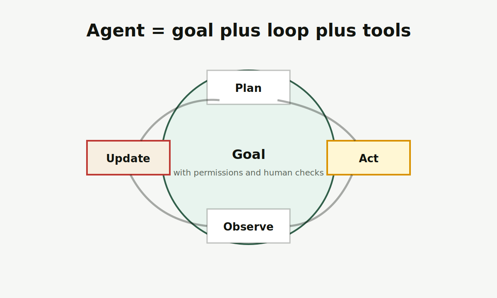

# Agent

Agent，通常译为智能体，是围绕目标规划步骤、调用工具、观察结果并继续推进任务的 AI 系统形态。

图片说明：原创循环图，展示智能体围绕目标进行计划、行动、观察和更新。

<Callout title="一句话先记住" type="info">
普通聊天机器人偏“问一句答一句”；Agent 更像“带工具和循环的执行系统”。能力越强，越需要权限边界和人工确认。
</Callout>

## 先记住这 3 点

<Cards>
  <Card title="Agent 有目标" description="它不是只回答问题，而是围绕目标拆解和推进任务。" />
  <Card title="Agent 会用工具" description="搜索、代码、浏览器、数据库、表格、日历、邮件都可能成为工具。" />
  <Card title="Agent 需要治理" description="越能执行动作，越需要权限、日志、回滚和人工确认。" />
</Cards>

## 给普通人的解释

如果 LLM 是“大脑的一部分”，Agent 更像“带流程的助手”。它收到目标后，会计划下一步、调用工具、观察结果，再决定是否继续。

这能带来更高自动化能力，也会带来更高风险。一个普通回答错了，你最多忽略它；一个 Agent 如果错误地发邮件、删文件、下单或改数据库，后果会更具体。所以 Agent 设计不能只看聪不聪明，还要看能不能被约束和追踪。

## 判断一个 Agent 是否可靠

<Steps>
  <Step>看它能调用哪些工具，权限是否最小化。</Step>
  <Step>看关键动作前是否要求用户确认。</Step>
  <Step>看执行日志是否清楚，失败后能否回滚。</Step>
  <Step>看它是否能在不确定时暂停，而不是强行完成。</Step>
</Steps>

## 和相近概念的区别

<Tabs items={["Chatbot", "Agent", "Workflow"]}>
  <Tab>
    Chatbot 更偏对话入口，可以很简单，也可以接入复杂系统。
  </Tab>
  <Tab>
    Agent 强调目标、循环、工具调用和状态更新。
  </Tab>
  <Tab>
    Workflow 是预先设计好的流程。Agent 可以参与流程，但不应该替代所有确定性规则。
  </Tab>
</Tabs>

## 常见误解

<Accordions>
  <Accordion title="Agent 是否一定更高级？">
    不一定。简单、稳定、可审核的流程，经常比自主 Agent 更适合高风险业务。
  </Accordion>
  <Accordion title="Agent 能不能完全放手？">
    对普通用户不建议。重要动作应保留人工确认，尤其是付款、发布、删除、改权限和发外部消息。
  </Accordion>
</Accordions>

## 延伸阅读

- [LLM](/glossary/llm)：理解智能体常用的语言模型基础。
- [RAG](/glossary/rag)：理解智能体如何接入外部资料。
- [智能体、产品与公司](/agents-products)：区分产品、模型、公司和系统形态。

## 参考来源

- [Anthropic, Building Effective Agents](https://www.anthropic.com/engineering/building-effective-agents)
- [Model Context Protocol specification](https://modelcontextprotocol.io/specification/2025-06-18)
- 最后核查日期：2026-04-19
