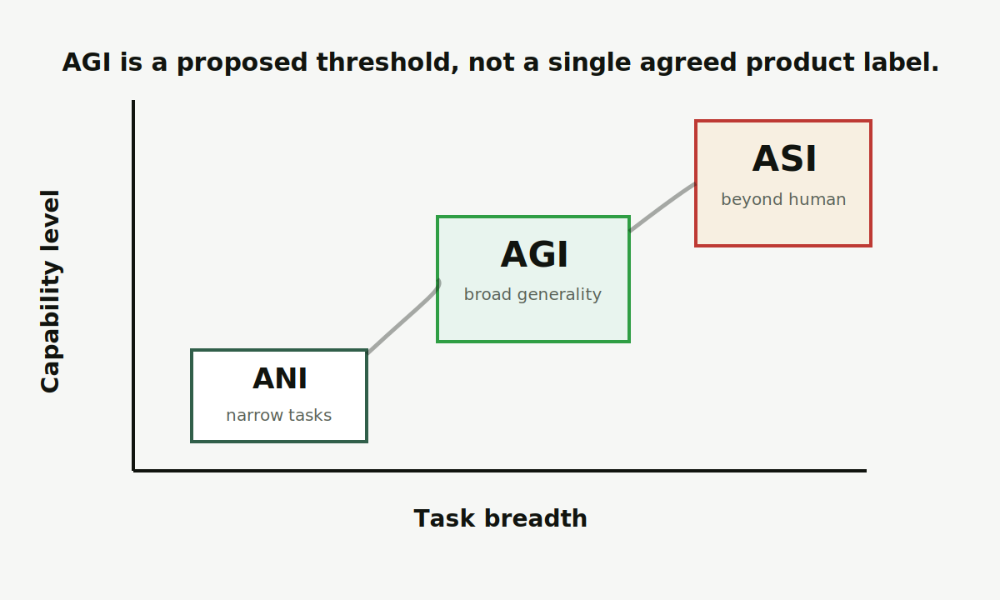

# AGI

AGI 是 Artificial General Intelligence，通常译为通用人工智能。它指向一种目标：AI 不只擅长单一任务，而能在广泛认知任务中学习、迁移和解决问题。

图片说明：原创能力图，展示 ANI、AGI、ASI 在任务广度和能力水平上的常见讨论位置。

<Callout title="准确性提醒" type="warn">
AGI 不是已经有公认标准的产品名。不同机构和研究者对“达到 AGI”的判断标准并不完全一致。
</Callout>

## 先记住这 3 点

<Cards>
  <Card title="AGI 强调通用性" description="它讨论的是跨任务学习和迁移，不是某个单点能力很强。" />
  <Card title="定义仍有争议" description="评估 AGI 需要看能力范围、可靠性、自主性和适应性。" />
  <Card title="不要和聊天能力划等号" description="会流畅对话不等于具备稳定、通用、可验证的问题解决能力。" />
</Cards>

## 给普通人的解释

今天很多 AI 更像“专门选手”：会推荐视频、识别图片、生成文字、写代码，但通常需要在特定任务和边界里工作。AGI 的讨论则更像“通才”：它能不能把学到的东西迁移到新领域，能不能在没见过的任务里自己形成策略，能不能稳定处理复杂目标。

这也是 AGI 难定义的原因。人类的“通用”本身就很复杂：常识、动机、身体经验、社会理解、长期规划都混在一起。当前大模型展示出更强的泛化能力，但是否足以称为 AGI，仍然是事实、标准和价值判断交织的问题。

## 如何判断一条 AGI 说法

<Steps>
  <Step>先问它是否给出了明确标准：任务范围、评估方法、失败条件。</Step>
  <Step>再看它讨论的是当前事实、未来预测，还是商业叙事。</Step>
  <Step>最后看有没有独立评测、可重复证据和边界说明。</Step>
</Steps>

## 和相近概念的区别

<Tabs items={["ANI", "AGI", "ASI"]}>
  <Tab>
    ANI 是狭义人工智能，擅长特定任务。今天大多数公开系统仍更接近这个范围。
  </Tab>
  <Tab>
    AGI 强调广泛任务能力和迁移能力，但没有全球统一的判定标准。
  </Tab>
  <Tab>
    [ASI](/glossary/asi) 指系统性超过人类认知能力的未来设想，比 AGI 更强，也更偏治理和风险讨论。
  </Tab>
</Tabs>

## 常见误解

<Accordions>
  <Accordion title="会聊天是不是就是 AGI？">
    不是。自然语言能力很重要，但 AGI 还涉及可靠性、工具使用、长期规划、跨领域迁移和真实环境适应。
  </Accordion>
  <Accordion title="AGI 是否一定会以单个模型出现？">
    不一定。AGI 可能被讨论成单个模型，也可能是模型、工具、记忆、执行系统和人机协作组成的系统。
  </Accordion>
</Accordions>

## 延伸阅读

- [AI](/glossary/ai)：先分清 AI 这个大范围。
- [ASI](/glossary/asi)：理解更强能力设想下的治理问题。
- [Agent](/glossary/agent)：为什么“会执行任务”的系统会让 AGI 讨论更现实。

## 参考来源

- [Morris et al., Levels of AGI](https://arxiv.org/abs/2311.02462)
- [OpenAI Charter](https://openai.com/charter/)
- 最后核查日期：2026-04-19
