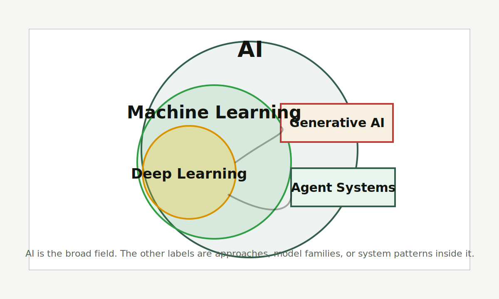

# AI

AI 是让机器表现出识别、预测、生成、决策等智能行为的一大类技术。它不是单一产品，也不是一个固定能力等级。

图片说明：原创范围图，展示 AI、机器学习、深度学习、生成式 AI 和智能体系统的关系。

<Callout title="一句话先记住" type="info">
AI 是最大范围的总称。今天你看到的聊天机器人、图像生成、推荐系统、语音识别和自动驾驶能力，都只是 AI 这个大范围里的不同分支。
</Callout>

## 先记住这 3 点

<Cards>
  <Card title="AI 是总称" description="它覆盖识别、预测、生成、规划和决策，不等于某个聊天产品。" />
  <Card title="能力边界差异很大" description="会写文章的系统，不一定能可靠做医学判断、财务决策或长期规划。" />
  <Card title="要看任务和证据" description="判断 AI 是否有用，应该看任务、数据、评估和失败边界。" />
</Cards>

## 给普通人的解释

如果把传统软件理解成“人把规则写进程序”，AI 更像“人给出数据、目标和反馈，让系统学出某种模式”。这不是说 AI 有人的意识，而是说它可以在大量样本中学习统计规律，再把规律用于新输入。

AI 可以很强，也可以很脆弱。它可能在某个任务上超过普通人，但在另一个任务上犯很低级的错。所以学习 AI 的第一步，不是问“AI 有没有智能”，而是问：它在什么任务上表现好，为什么好，失败时会怎样。

## 和相近概念的区别

<Tabs items={["AI", "机器学习", "生成式 AI"]}>
  <Tab>
    AI 是最大范围，包括规则系统、机器学习、专家系统、搜索、规划和生成式模型等路线。
  </Tab>
  <Tab>
    [机器学习](/machine-learning) 是 AI 的重要方法之一，核心是从数据中学习规律。
  </Tab>
  <Tab>
    [生成式 AI](/generative-multimodal) 是 AI 的应用形态之一，重点是生成文本、图片、音频、视频或代码。
  </Tab>
</Tabs>

## 常见误解

<Accordions>
  <Accordion title="误解一：AI 就是 ChatGPT">
    ChatGPT 是一个 AI 产品，但 AI 远大于 ChatGPT。推荐系统、图像识别、语音识别、机器人控制也都属于 AI 讨论范围。
  </Accordion>
  <Accordion title="误解二：AI 会做一件事，就能可靠做所有事">
    不同 AI 系统的训练数据、目标函数、工具权限和评估方式差异很大。一个系统能写总结，不代表它能可靠处理高风险决策。
  </Accordion>
</Accordions>

## 延伸阅读

- [AGI](/glossary/agi)：为什么“通用智能”仍然有争议。
- [LLM](/glossary/llm)：为什么大语言模型成为普通人接触 AI 的主要入口。
- [AI 术语百科](/glossary)：回到全部术语索引。

## 参考来源

- [OECD AI Principles](https://oecd.ai/en/ai-principles)
- [NIST AI Risk Management Framework](https://www.nist.gov/itl/ai-risk-management-framework)
- 最后核查日期：2026-04-19
