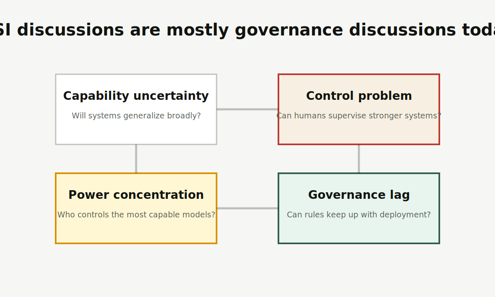

# ASI

ASI 是 Artificial Superintelligence，通常译为人工超级智能。它不是“某个任务比人强”，而是指在大量关键认知任务上系统性超过人类的未来 AI 设想。

图片说明：原创风险图，把 ASI 讨论拆成能力不确定性、可控性、权力集中和治理滞后四条线。

<Callout title="事实边界" type="warn">
ASI 目前不是已经公开公认实现的产品类别。围绕 ASI 的现实价值，主要在于提前讨论安全、监督、治理和权力分配。
</Callout>

## 先记住这 3 点

<Cards>
  <Card title="它比 AGI 更强" description="AGI 强调通用，ASI 强调系统性超人能力。" />
  <Card title="它仍是前瞻概念" description="是否会出现、何时出现、以什么形态出现，都存在巨大分歧。" />
  <Card title="现实重点是治理" description="强 AI 的评估、监督、部署权限和国际协调已经是现实议题。" />
</Cards>

## 给普通人的解释

讨论 ASI 时，人们真正担心的不是“机器会不会像电影角色一样有情绪”，而是：如果一个系统比人类团队更擅长科研、工程、规划、说服和组织行动，我们如何确认它长期按人的真实意图工作？

系统越强，越难靠人类逐条检查。一个普通工具出错，用户还能发现并纠正；一个极强系统如果能自己规划、调用工具、影响外部世界，就需要更严格的评估、权限和治理机制。

## 四类问题

<Tabs items={["能力", "控制", "权力", "治理"]}>
  <Tab>
    能力问题：系统是否真的能跨领域超越人类，还是被短期演示夸大。
  </Tab>
  <Tab>
    控制问题：系统越强，人类越难验证它是否稳定遵循目标和约束。
  </Tab>
  <Tab>
    权力问题：极强 AI 如果集中在少数机构或国家手中，会带来不对称影响。
  </Tab>
  <Tab>
    治理问题：法规、审计和国际协调通常慢于技术部署。
  </Tab>
</Tabs>

## 常见误解

<Accordions>
  <Accordion title="ASI 是已经发生的事实吗？">
    不是。它目前是前沿技术治理中的未来情景和风险框架，不应被写成已经实现的事实。
  </Accordion>
  <Accordion title="讨论 ASI 是否就是科幻？">
    不完全是。虽然 ASI 本身仍是前瞻概念，但高能力 AI 的评估、部署、审计和治理已经是现实政策问题。
  </Accordion>
</Accordions>

## 延伸阅读

- [AGI](/glossary/agi)：理解 AGI 和 ASI 的边界。
- [AI](/glossary/ai)：回到 AI 的基本范围。
- [前沿、安全与治理](/frontier)：理解对齐、偏差、幻觉和规模规律。

## 参考来源

- [OpenAI, Governance of Superintelligence](https://openai.com/index/governance-of-superintelligence/)
- [Google DeepMind, Frontier Safety Framework](https://deepmind.google/blog/introducing-the-frontier-safety-framework/)
- 最后核查日期：2026-04-19
