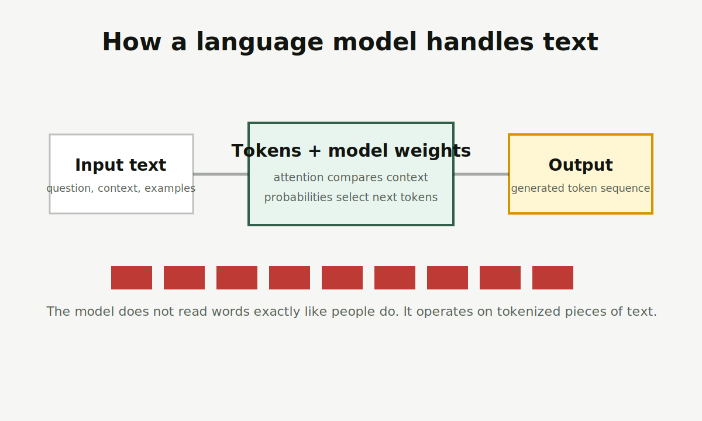

# LLM

LLM 是 Large Language Model，大语言模型。它把文本切成 Token，在上下文中计算关系，并生成后续内容。

图片说明：原创流程图，简化展示输入文本、Token、模型权重和输出之间的关系。

<Callout title="一句话先记住" type="info">
LLM 不是搜索引擎本身。它更像一个根据上下文生成语言的模型；如果要回答最新或专有资料，通常需要外接检索、工具或数据库。
</Callout>

## 先记住这 3 点

<Cards>
  <Card title="它按 Token 工作" description="模型看到的不是完整汉字或英文单词，而是被切分后的文本片段。" />
  <Card title="它依赖上下文" description="提示词、资料、历史对话和工具返回都会影响输出。" />
  <Card title="它会生成看似可信的错误" description="语言流畅不等于事实正确，重要内容需要来源验证。" />
</Cards>

## 给普通人的解释

LLM 的基本能力来自大量文本训练。训练让模型学会语言结构、知识关联、常见推理形式和任务格式。使用时，模型根据当前上下文预测接下来更可能出现的 Token，连续生成就形成了回答。

这解释了两个现象：它很擅长写作、总结、改写、翻译和代码辅助；但它也可能在没有足够证据时编造细节。因为“语言上顺”不等于“事实被验证”。

## 使用 LLM 时的判断流程

<Steps>
  <Step>先明确任务：写作、总结、分析、检索、代码，还是决策辅助。</Step>
  <Step>再补足上下文：目标、资料、格式、限制、示例。</Step>
  <Step>最后验证输出：事实、引用、计算、风险和适用范围。</Step>
</Steps>

## 和相近概念的区别

<Tabs items={["LLM", "Transformer", "ChatGPT"]}>
  <Tab>
    LLM 是模型类别，重点是大规模语言建模能力。
  </Tab>
  <Tab>
    Transformer 是影响现代 LLM 的重要架构，不等于所有 AI。
  </Tab>
  <Tab>
    ChatGPT 是产品体验，背后可以接入不同模型、工具和系统策略。
  </Tab>
</Tabs>

## 常见误解

<Accordions>
  <Accordion title="LLM 会联网查资料吗？">
    模型本身不等于联网搜索。产品可以给模型接入搜索、浏览器、数据库或 RAG，但这是系统能力，不是裸模型一定具备。
  </Accordion>
  <Accordion title="模型越大就一定越适合我吗？">
    不一定。成本、速度、上下文长度、工具能力、隐私要求和任务类型都会影响选择。
  </Accordion>
</Accordions>

## 延伸阅读

- [RAG](/glossary/rag)：让 LLM 使用外部资料的一种常见方法。
- [Agent](/glossary/agent)：让模型围绕目标调用工具和推进任务。
- [大模型与提示工程](/llm-prompting)：理解 Token、提示、微调和偏好优化。

## 参考来源

- [Vaswani et al., Attention Is All You Need](https://arxiv.org/abs/1706.03762)
- [Stanford CS324, Large Language Models](https://stanford-cs324.github.io/winter2022/)
- 最后核查日期：2026-04-19
