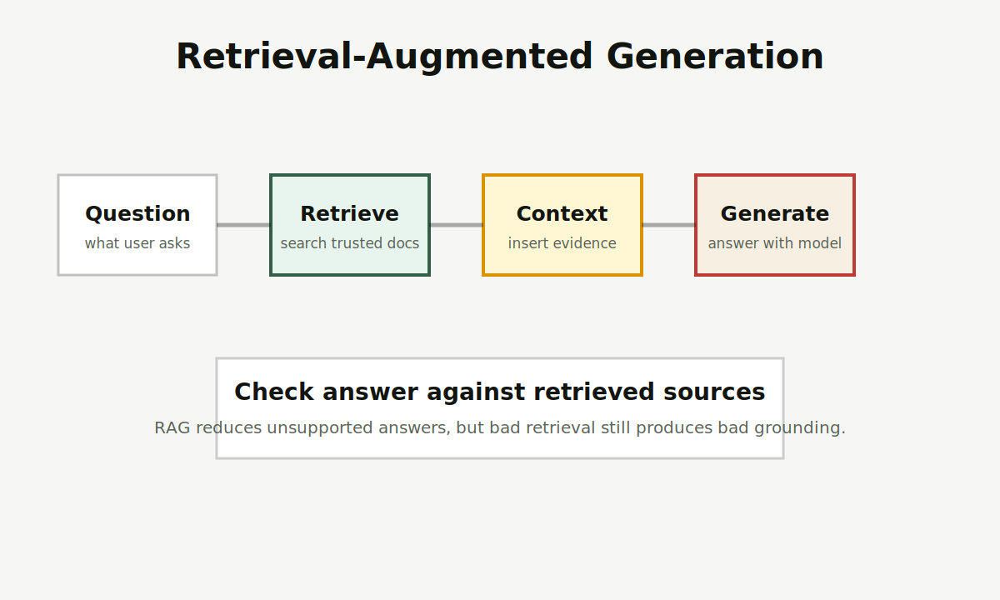

# RAG

RAG 是 Retrieval-Augmented Generation，检索增强生成。它让模型回答前先从外部资料中检索相关内容，再把检索结果放进上下文生成答案。

图片说明：原创流程图，展示问题、检索、上下文注入、生成和来源检查。

<Callout title="一句话先记住" type="info">
RAG 不是让模型“记住更多”，而是让模型“回答前先看资料”。资料找得准，回答才更有根据。
</Callout>

## 先记住这 3 点

<Cards>
  <Card title="解决资料不足" description="当模型不知道你的内部文档、最新信息或专有知识时，RAG 通常比直接改提示更有效。" />
  <Card title="检索质量决定上限" description="切分、索引、召回和排序都会影响最终答案。" />
  <Card title="不能消灭幻觉" description="RAG 能降低无依据回答，但错误资料、漏检和误读仍会带来错误。" />
</Cards>

## 给普通人的解释

你可以把 RAG 想成“开卷答题”。普通 LLM 像凭记忆回答；RAG 则先从指定资料库里找几段最相关材料，再要求模型根据这些材料回答。

这对企业知识库、客服、政策问答、研究资料整理很有用。关键是：资料库要可靠，检索要找对，回答还要能指出依据。否则 RAG 只是把错误资料包装成更像真的答案。

## 一个最短 RAG 流程

<Steps>
  <Step>把文档切成合适片段，并记录来源。</Step>
  <Step>把片段转成 Embedding，放入向量数据库或搜索索引。</Step>
  <Step>用户提问时检索相关片段。</Step>
  <Step>把片段和问题一起交给 LLM 生成答案。</Step>
  <Step>检查答案是否真的由检索片段支持。</Step>
</Steps>

## 和相近概念的区别

<Tabs items={["RAG", "微调", "长上下文"]}>
  <Tab>
    RAG 重点是外接资料，适合回答最新、内部、可更新的知识。
  </Tab>
  <Tab>
    微调重点是改变模型稳定行为或任务格式，不是把所有知识塞进模型。
  </Tab>
  <Tab>
    长上下文可以放更多资料，但仍需要排序、去噪和引用检查。
  </Tab>
</Tabs>

## 常见误解

<Accordions>
  <Accordion title="RAG 能保证答案一定正确吗？">
    不能。RAG 只能改善资料依据。检索错、资料错、问题歧义或模型误读，都会导致错误。
  </Accordion>
  <Accordion title="向量数据库就是 RAG 吗？">
    不是。向量数据库只是 RAG 的常见组件之一。完整 RAG 还包括文档处理、检索策略、提示设计、生成和验证。
  </Accordion>
</Accordions>

## 延伸阅读

- [LLM](/glossary/llm)：理解 RAG 接入的模型基础。
- [大模型与提示工程](/llm-prompting)：理解 Embedding、向量数据库和提示词。
- [资料与来源](/resources)：为什么知识站需要来源维护。

## 参考来源

- [Lewis et al., Retrieval-Augmented Generation for Knowledge-Intensive NLP Tasks](https://arxiv.org/abs/2005.11401)
- [AWS, What is Retrieval-Augmented Generation](https://aws.amazon.com/what-is/retrieval-augmented-generation/)
- 最后核查日期：2026-04-19
