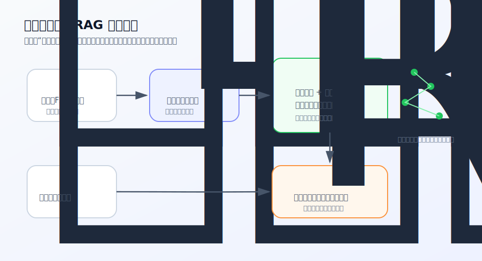

# Vector Database

Vector Database 是向量数据库，用来存储 Embedding 以及对应的来源、标题、权限等元数据，并在用户查询时快速找出“语义上最相近”的内容片段。

图片说明：原创流程图，展示资料和问题先被转成向量，再由向量数据库检索相关片段，最后进入 RAG 或语义搜索流程。

<Callout title="一句话先记住" type="info">
向量数据库负责“找相似资料”，不是负责“判断资料是否正确”，也不是直接让模型变聪明。
</Callout>

## 先记住这 3 点

<Cards>
  <Card title="它服务检索" description="向量数据库常用于语义搜索、推荐和 RAG，把问题匹配到相近资料片段。" />
  <Card title="Embedding 决定入口" description="如果内容被转成了糟糕的向量，数据库再快也只是在快速找错东西。" />
  <Card title="仍要做来源校验" description="向量相似只说明“可能相关”，不说明资料真实、最新、完整或适合回答。" />
</Cards>

## 给普通人的解释

关键词搜索像是在问：“哪些文档里出现了这个词？”向量数据库更像是在问：“哪些内容意思接近这个问题？”

比如用户问“怎么报销出差打车费”，资料库里可能没有完全一样的句子，但有一段“差旅交通费用报销规则”。如果这段文字和问题的 Embedding 足够接近，向量数据库就能把它找出来。

这就是它在 RAG 里有用的原因：LLM 本身不一定知道你的内部资料，也不应该凭空编答案；向量数据库先把相关资料取出来，再由模型基于这些资料组织回答。

## 它和 Prompt、RAG、Fine-Tuning 的边界

<Tabs items={["Vector Database", "Prompt", "RAG", "Fine-Tuning"]}>
  <Tab>
    向量数据库是检索组件。它存储向量、做相似度搜索、返回候选资料片段。
  </Tab>
  <Tab>
    Prompt 负责告诉模型任务、格式、约束和引用要求。提示词写得再好，也不会自动补齐缺失资料。
  </Tab>
  <Tab>
    RAG 是完整流程：资料处理、Embedding、检索、排序、提示、生成和校验。向量数据库只是其中一环。
  </Tab>
  <Tab>
    Fine-Tuning 改变模型行为、格式或领域适配倾向；向量数据库不改模型参数，只在回答前提供外部资料。
  </Tab>
</Tabs>

## 一个最短使用流程

<Steps>
  <Step>把文档切成适合检索的片段，并保留标题、URL、时间、权限等元数据。</Step>
  <Step>用 Embedding 模型把每个片段转成向量。</Step>
  <Step>把向量和元数据写入向量数据库，并建立索引。</Step>
  <Step>用户提问时，把问题也转成向量。</Step>
  <Step>检索相近片段，必要时重排、去重，再交给 LLM 或搜索界面。</Step>
</Steps>

## 常见误解

<Accordions>
  <Accordion title="向量数据库就是知识库吗？">
    不是。它更像知识库的检索层。真正的知识质量来自原始资料、切分方式、更新时间、权限控制和后续审核。
  </Accordion>
  <Accordion title="有了向量数据库，RAG 就一定准确吗？">
    不能。检索可能漏掉关键资料，也可能找出看似相关但不能回答问题的片段。答案仍要检查来源是否支持结论。
  </Accordion>
  <Accordion title="它能替代微调吗？">
    通常不能。向量数据库适合取外部资料；微调适合让模型更稳定遵守某类任务格式、语气或领域模式。两者解决的问题不同。
  </Accordion>
</Accordions>

## 延伸阅读

- [Embedding](/glossary/embedding)：理解内容如何变成可检索的向量。
- [RAG](/glossary/rag)：理解向量数据库在检索增强生成里的位置。
- [Prompt Engineering](/glossary/prompt-engineering)：理解检索结果如何通过提示交给模型。
- [Fine-Tuning](/glossary/fine-tuning)：区分“取资料”和“改模型行为”。

## 参考来源

- [OpenAI, Vector embeddings](https://developers.openai.com/api/docs/guides/embeddings)
- [Johnson, Douze, Jégou, Billion-scale similarity search with GPUs](https://arxiv.org/abs/1702.08734)
- [Qdrant, Vector search overview](https://qdrant.tech/documentation/overview/vector-search/)
- 最后核查日期：2026-05-06
